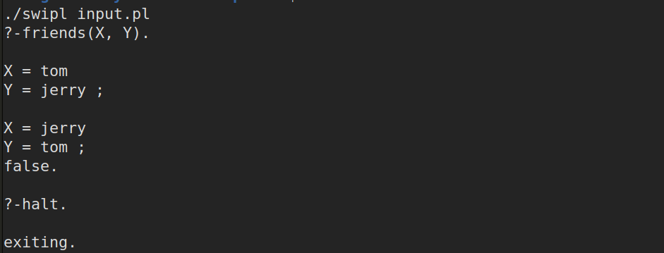

# Prolog and Toy Ocaml Interpreter
## COL226 : Toy Logic Programming Language

## Problem Statement:
In this project, you will write a simplified version of a Logic Programming interpreter in OCaml.

You will first define an ML data type to represent the structure of a legitimate LogPro program.

1. A program is a set (list) of clauses. 
2. A clause can either be a fact or a rule. A fact has a head but no body.  A rule has a head and a body.  
3. The head is a single atomic formula.  A body is a sequence of atomic formulas.
4. An atomic formula is a k-ary predicate symbol followed by k terms.
5. A term is either a variable, a constant, or a k-ary function symbol with k sub-terms.
6. A goal is a set (list) of atomic formulas.

You need to take your implementation of unification to use as the parameter-passing mechanism. (Note: by pretending the predicate symbol is a function symbol, you can perform resolution of goals and program clauses).

You also need to develop a back-tracking strategy to explore the resolution search space.   You need to be able to replace a goal by subgoals, as found by applying a unifier to the body of a program clause whose head unified with the chosen subgoal.

## Implementation:
1. `main.ml` file reads the input file and commands.
2. `lexer.mll` and `parser.mly` are *lexer* and *parser* files respectively (implemented in OCaml).
3. `backend.ml` is the file where all the functions are implemented.

## Testing and Executing:
1. run `make` to create the executable named `swipl`.
2. run `make run` or `./swipl input.pl` where `input.pl` contains all the prolog facts and rules to load in the program.
3. type the query in console.
4. To search further for the query, type `;` and hit enter.
5. use `halt.` to exit the program.

Implemented by:  
Manoj Kumar (manoj2601)  
manoj18.iitd@gmail.com  